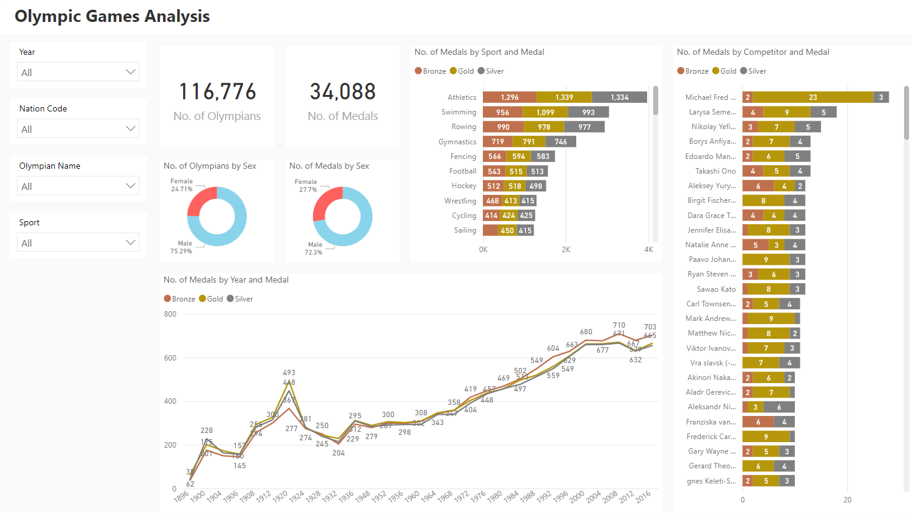
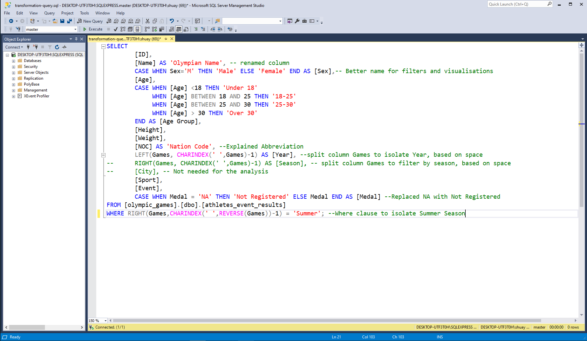

# Olympic-Games

---
## Business Problem
The business problem is **“As a data analyst working at a news company you are asked to visualize data that will help readers understand how countries have performed historically in the summer Olympic Games. You also know that there is an interest in details about the competitors, so if you find anything interesting then don’t hesitate to bring that in also. The main task is still to show historical performance for different countries, with the possibility to select your own country.”**

Breaking down the task, I identified that I needed to create an interactive dashboard as I was asked to "visualise data... with the possibility to select your own country" and that the data I will be working with is data that has been collected over a long time period relating to performance of many nations in the Olympic Games.

---
## Analysis
Here is a link to my Analysis: https://shuayb-ibrahim.github.io/Olympic-Games-Analysis/
